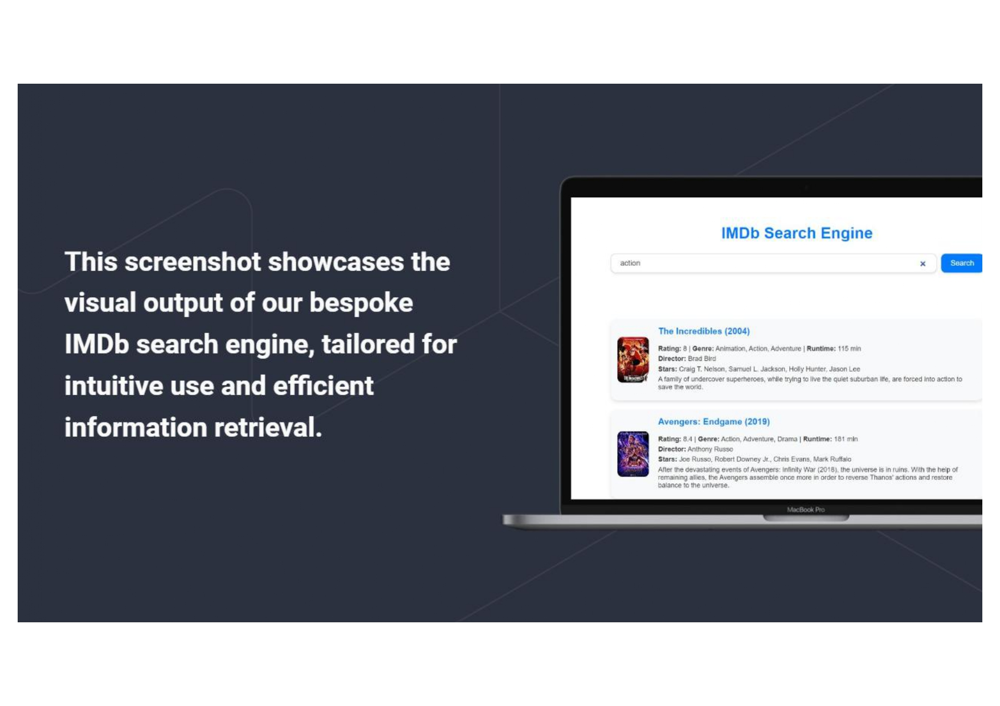

# 🎬 IMDb Smart Search Engine

An intelligent NLP-powered search engine that allows users to query and explore IMDb's top 1000 movies using natural language. Built as part of a **group project for the "Information Retrieval" module (2024)**.

---

## 👥 Group Contribution

This project was developed collaboratively as part of our university coursework.  
**The backend** (Flask API, data preprocessing, ranking models) was designed and implemented by **Vickshan Vicknakumaran** and a teammate.  
The **frontend** (React-based UI) was handled by other team members.

---

## 📌 Project Overview

**IMDb Smart Search Engine** helps users find relevant movies using natural queries like:

> “Action film with Leonardo DiCaprio from the 2000s”

Instead of relying on exact title matches, the system ranks results using semantic similarity via **BM25** and **TF-IDF**.

---

## 📱 Features

- 🔎 Search by title, genre, director, actors, or keywords
- 🧠 Ranking with **BM25** and **TF-IDF cosine similarity**
- 🧹 Preprocessing with NLTK (tokenization, stopwords, stemming)
- ⚡ RESTful API using Flask
- 🔄 CORS enabled for React frontend integration
- 📈 Based on IMDb Top 1000 dataset (CSV)

---

## 🛠 Technologies Used

- **Backend**:
  - Python, Flask, NLTK
  - BM25Okapi (`rank_bm25`)
  - Scikit-learn (TF-IDF, cosine similarity)
  - Pandas
  - Flask-CORS

- **Frontend**:
  - React (handled by front-end team members)


## 💡 How It Works

- User submits a search query via the React frontend
- Flask backend receives the query, preprocesses it with NLTK
- Two models (BM25 & TF-IDF) rank the top matching movies
- Combined and deduplicated results are returned as JSON
- Frontend displays results with movie posters and metadata

---

## 🖼️ Screenshots

<p align="center">
  
</p>

---

## 🔮 Future Improvements

- Use Transformer models (e.g. BERT) for context-aware ranking
- Add user preferences/history for personalized results
- Integrate movie streaming service availability
- Build chatbot-style interface

---

## 📂 Example API Call


Returns:

```json
{
  "search_results": [
    {
      "Series_Title": "The Dark Knight",
      "Genre": "Action, Crime, Drama",
      "Director": "Christopher Nolan",
      "Stars": ["Christian Bale", "Heath Ledger", "Aaron Eckhart", "Michael Caine"],
      "IMDB_Rating": 9.0,
      ...
    }
  ]
}


##📚 Module Information
-📘 Module: CI6416 – Information Retrieval
-🎓 Year: 2024
-🏫 University: Queen Mary, University of London

